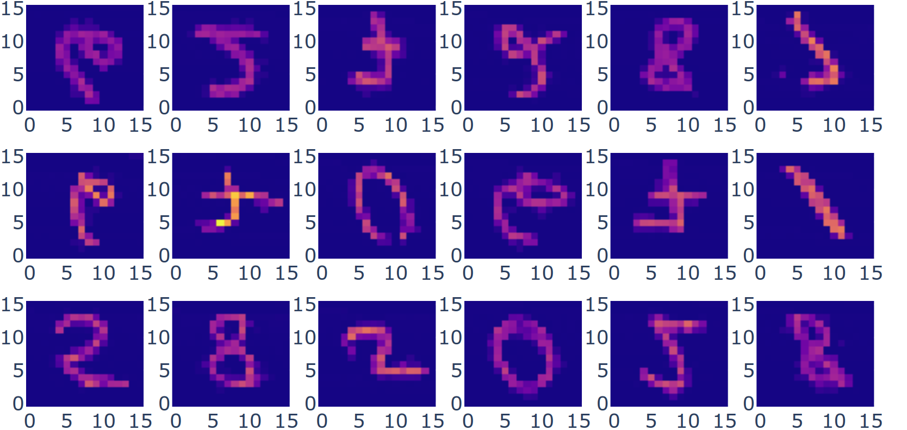

# Image Generation and Distribution Loading with Quantum Generative Adversarial Networks

**Penn Ave Fish Company**

## How-To-Run

We recommend using Anaconda or Miniconda for package management. To install all dependencies, run `conda env create -f environment.yml ` followed by `conda activate qgan-image-generation`.

## Interactive demonstrations

1. [Tutorial and Feature Showcase](https://allenator.github.io/quantum-gan-image-generation/docs/image-generation)
2. [A Case Study With MNIST](https://allenator.github.io/quantum-gan-image-generation/docs/mnist)

## Introduction

A prerequisite for quantum algorithms to outperform their classical counterparts lies in the ability to efficiently load the classical input of the algorithms into quantum states. However, to prepare a generic quantum state exactly requires $\mathrm{O}(2^n)$ gates [[1](https://journals.aps.org/prl/abstract/10.1103/PhysRevLett.85.1334)], which can impede the power of exponential-speedup quantum algorithms before they come into play. For practical purposes, Quantum machine learning (QML) can be adopted to approximate the desired loading channel via training. Quantum generative adversarial networks (qGAN) in particular have shown great promise in accomplishing the task with $\mathrm{O}(\mathrm{poly}(n))$ gates [[2](https://www.nature.com/articles/s41534-019-0223-2)]. Similar to its classical counterpart, qGAN consists of both a generator for synthesizing data to match the real data and a discriminator for discerning real data from the product of the generator. The difference between the two is that qGAN uses a quantum generator to approximate the quantum state, and the discriminator can be either classical or quantum depending on whether the input data is classical or quantum [[3](https://pennylane.ai/qml/demos/tutorial_QGAN.html)]. Generally, the qGAN trains its generator and discriminator in an alternating fashion in the form of a zero-sum game, and ends the training when the relative entropy (i.e. the difference between the real data and the synthesized one, one measure of the training performance) converges [[2](https://www.nature.com/articles/s41534-019-0223-2)].

For our project, we aim to demonstrate the efficient loading of multi-dimensional classical distribution using qGAN with a classical discriminator. To better present our result and offer a potential generalization of our project, we choose images with complex features as our classical datasets. For each image, the training process finds a set of circuit parameters such that the probability distribution of the circuit measurement output resembles the the normalized pixel values of the image at each corresponding position.

## Highlights

In the implementation, we use PennyLane to construct the quantum circuit for the task. The classical discriminator is trained using Keras layers on TensorFlow. We successfully demonstrate reliable learning of images with multi-modal distributions. It is well documented that arbitrary images and distributions with complex features are difficult to train. For these instances, we devise a remapping routine that utilizes an array automorphism to simplify the target distribution to a unimodal one. Compared to the state-of-the-art work [[4](https://arxiv.org/pdf/2010.06201.pdf)] on qGAN for image generation, our method shows significant improvement in parameter complexity, circuit depth and training time. Under remapping, when configured with $8$ qubits, $16$ parameters and a circuit depth of $5$, and trained on $16 \times 16$ MNIST images with epoch size $10^4$ and batch size $10^3$, our model is able to reduce the mean cross-entropy between generated images and original images to below $1.6 \times 10^{-2}$ within $60$ to $70$ epochs. Convergence in cross-entropy is reached below $1.5 \times 10^{-2}$ after about $200$ epochs. The generated images closely resemble the original with excellent signal-to-noise ratio and clearly distinguishable high-probability foreground.

## References

[[1](https://journals.aps.org/prl/abstract/10.1103/PhysRevLett.85.1334)] Grover, L. K., Synthesis of quantum superpositions by quantum computation. Phys. Rev. Lett. 85, 1334–1337 (2000).

[[2](https://www.nature.com/articles/s41534-019-0223-2)] Zoufal, C., Lucchi, A. & Woerner, S., Quantum Generative Adversarial Networks for learning and loading random distributions. npj Quantum Inf 5, 103 (2019).

[[3](https://pennylane.ai/qml/demos/tutorial_QGAN.html)] PennyLane dev team, Quantum Generative Adversarial Networks with Cirq + TensorFlow (2021).

[[4](https://arxiv.org/pdf/2010.06201.pdf)] H. Huang et al.,  Experimental Quantum Generative Adversarial Networks for Image Generation. arxiv-preprint, (2020).